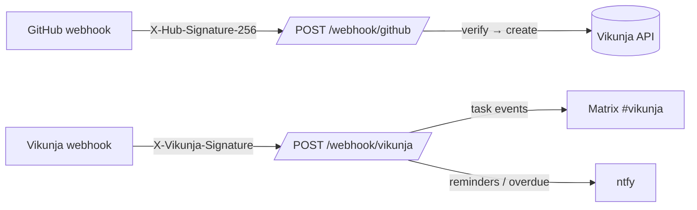

[](https://claude.ai/code)
[](https://opensource.org/licenses/MIT)

# vikunja-webhook-listener

A small FastAPI service that bridges two independent webhook directions for a
self-hosted [Vikunja](https://vikunja.io) instance:

1. **GitHub → Vikunja** — an opened issue or PR becomes a task in a mapped project.
2. **Vikunja → Matrix / ntfy** — task events post to a Matrix room; reminders/overdue
   notifications push to ntfy.

Both inbound endpoints are internet-reachable (behind SWAG), so each verifies an HMAC
signature and **fails closed**: a direction whose secret is unset rejects every request
(`401`) rather than skipping verification.



> **Design note.** This service deliberately departs from `plane-webhook-listener`, whose
> `verify_signature()` returns `True` (skips verification) when no secret is configured —
> a fail-open hole on an internet-facing endpoint. Here, no secret ⇒ endpoint disabled ⇒
> `401`, and a missing/blank signature never matches.

## Endpoints

| Method | Path | Purpose |
|--------|------|---------|
| `GET` | `/health` | Liveness + which inbound directions are enabled |
| `POST` | `/webhook/github` | GitHub issues/PRs (`opened`) → Vikunja task |
| `POST` | `/webhook/vikunja` | Vikunja events → Matrix/ntfy |

## Configuration

| Var | Purpose | Default |
|-----|---------|---------|
| `GITHUB_WEBHOOK_SECRET` | HMAC key for GitHub inbound (unset ⇒ endpoint disabled) | — |
| `VIKUNJA_WEBHOOK_SECRET` | HMAC key for Vikunja inbound (unset ⇒ endpoint disabled) | — |
| `VIKUNJA_API_URL` | Vikunja base URL | `https://vikunja.helmforge.me` |
| `VIKUNJA_API_TOKEN` | Service token used to create tasks from GitHub events | — |
| `GITHUB_DEFAULT_PROJECT_ID` | Fallback Vikunja project for GitHub tasks | `0` |
| `GITHUB_PROJECT_MAP` | JSON map `{"owner/repo": project_id}` (overrides default) | `{}` |
| `MATRIX_HOMESERVER` / `MATRIX_ACCESS_TOKEN` / `MATRIX_ROOM_ID` | Matrix posting | — |
| `NTFY_URL` / `NTFY_TOPIC` / `NTFY_TOKEN` | ntfy push (token optional) | `https://ntfy.glitch42.com` |
| `HOST` / `PORT` | Bind address | `0.0.0.0` / `8502` |

## Event handling

Vikunja event names were verified against the docs (the original build plan was slightly
off):

| Event | Action |
|-------|--------|
| `task.created` | Matrix: task created |
| `task.updated` (task `done: true`) | Matrix: task completed — there is **no** `task.done` event |
| `task.comment.created` | Matrix: comment added |
| `task.reminder.fired`, `task.overdue`, `tasks.overdue` | ntfy push |

> `task.reminder.fired` and `*.overdue` are **user** webhook events, registered in Vikunja
> account settings (`/api/v1/user/settings/webhooks`), not project webhooks. See
> [`docs/forge.md`](docs/forge.md).

## Development

```bash
pip install -e ".[dev]"
ruff check src/ tests/ && ruff format --check src/ tests/
pytest --cov=vikunja_webhook_listener --cov-report=term-missing
```

## Deployment

PM2 service on forge behind SWAG. See [`docs/forge.md`](docs/forge.md).
